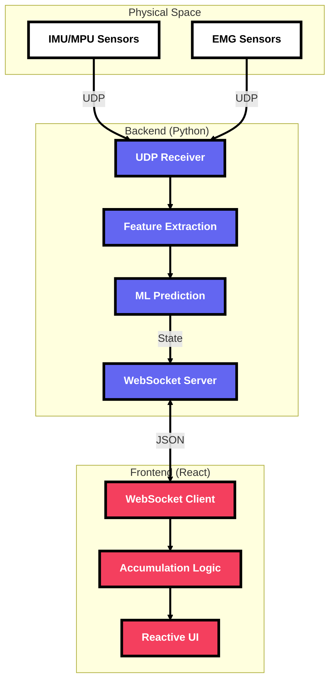

# 🦾 RemoteCanvas: Biophysical Interactive Display

**Transform movement and muscle activity into a reactive, remote-controlled stage.**

RemoteCanvas is a low-latency, WebSocket-driven display system that translates high-fidelity data from **IMU/MPU** and **EMG** sensors into interactive digital art. Designed for interactive installations, biometric performance, and dynamic digital signage, it provides a high-contrast canvas where geometry and language are driven by physical agency.

---

## 🚀 The Pitch: Why RemoteCanvas?

In a world of static digital signage, RemoteCanvas brings **agency**. Whether you're building an interactive museum exhibit, a real-time collaborative workspace, or a performance art piece, this project bridge the gap between "Input" and "Display" with zero friction.

### Key Capabilities:
- **🦾 Biometric & Inertial Control**: Built to ingest high-fidelity data from **IMU/MPU sensors** and **EMG** devices, translating physical movement and muscle activity into digital geometric form.
- **🔤 Dynamic Accumulation**: Seamlessly build words and sequences letter-by-letter. The UI intelligently differentiates between shapes and text, allowing for fluid language expression.
- **🎨 Reactive Geometry**: Instantly switch between circles, squares, and triangles. Each shape is a first-class citizen with immediate state synchronization.
- **⚡ Zero-Latency Control**: Optimized WebSocket broadcasting ensures that every movement, resize, or content change is reflected across all display clients in real-time.
- **💀 Neo-Brutalist Aesthetic**: A design language that is raw, honest, and high-impact. High-contrast borders and vibrant colors ensure visibility and style.

---

## 🏗 System Architecture



---

RemoteCanvas is designed with a decoupled architecture, prioritizing portability and performance.

### 1. The Real-time Core (Backend)
The system is powered by a lightweight WebSocket server (available in both **Python** and **Node.js**). It acts as a stateless state-synchronizer:
- **State Broadcasting**: Every change (position, content, size) is broadcasted to all connected clients in a single hop.
- **Multi-Client Support**: Multiple displays can subscribe to the same stream for synchronized multi-screen experiences.

### 2. The Smart Display (Frontend)
Built with **Next.js 15** and **React**, the frontend is more than just a renderer:
- **Content Accumulation**: Features a smart frontend logic that detects repeated character commands to build words while allowing shapes to act as immediate replacements.
- **Dynamic Layout Engine**: The `Shape` component uses a flexible CSS-driven layout that prevents text clipping even as sequences grow, while maintaining strict height constraints.
- **Webcam Integration**: Ready for AR/Background overlays with built-in media stream handling.

---

## 🚦 Getting Started

### Prerequisites
- [Node.js](https://nodejs.org/) (v18+)
- [pnpm](https://pnpm.io/) (Recommended)

### 1. Fire up the Server
```bash
# Python
python main.py
```

### 2. Launch the Display
```bash
cd frontend
pnpm install
pnpm dev
```

---

## 🎨 Aesthetic Philosophy
RemoteCanvas embraces **Neo-Brutalism**:
- **Hard Shadows**: Unapologetic offsets that create depth.
- **Thick Borders**: Defines boundaries clearly for high visibility.
- **High-Saturation**: Using indigo, emerald, and rose to command attention.

---

*Built for the creators of interactive experiences.*
