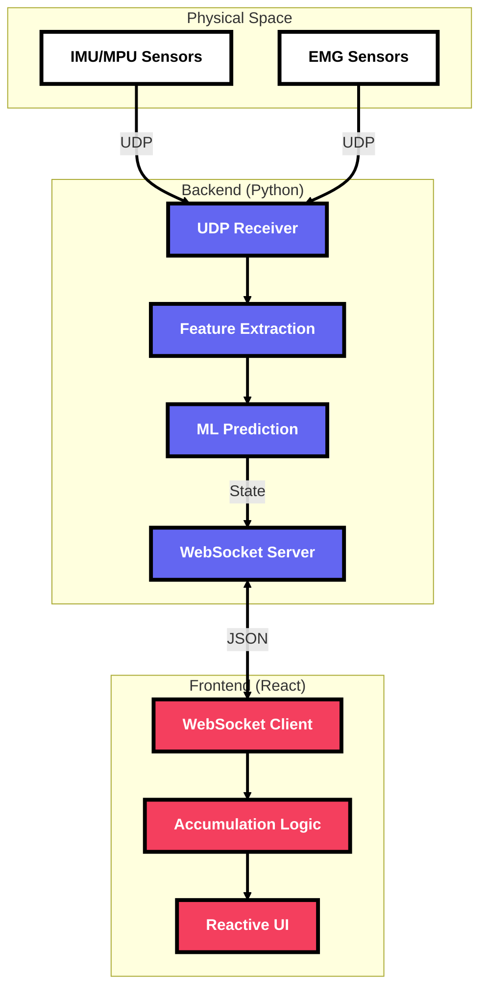

# 👌 Mudra

**Next-generation human–computer interaction through biophysical intelligence.**

Mudra is a multi-purpose wearable input device that combines **EMG** (muscle activity) and **IMU** (motion) signals to recognize gestures in real time. By fusing these data streams, Mudra achieves more robust and accurate gesture recognition compared to traditional camera-based systems, which are often limited by line-of-sight and lighting conditions.

The predictions are streamed instantly to a live, reactive interface via **WebSockets**, enabling low-latency, privacy-friendly, and hardware-efficient interaction.

---

## 🚀 The Pitch: Why Mudra?

Mudra offers a tactile, high-fidelity bridge between physical intent and digital action. Designed for precision and versatility, it works where cameras fail—providing a privacy-first, hardware-efficient solution for interactive environments.

### Key Capabilities:
- **🦾 EMG & IMU Fusion**: Combines muscle activity and motion data for robust, accurate recognition that outperforms camera-based tracking.
- **⚡ Low-Latency Streaming**: Instant WebSocket broadcasting ensures real-time feedback with minimal overhead.
- **🔐 Privacy-Friendly**: No cameras required. All interaction is derived from biometric and inertial signals, preserving user privacy.
- **🔤 Dynamic Accumulation**: A smart frontend that builds language and geometry in real-time based on incoming gesture streams.
- **💀 Neo-Brutalist Aesthetic**: A high-impact, raw design language that commands attention and ensures visibility.

---

## 🏗 System Architecture



---

Mudra is designed with a decoupled architecture, prioritizing portability and performance.

### 1. The Real-time Core (Backend)
The system is powered by a lightweight WebSocket server in **Python**. It acts as a stateless state-synchronizer:
- **State Broadcasting**: Every change (position, content, size) is broadcasted to all connected clients in a single hop.
- **Multi-Client Support**: Multiple displays can subscribe to the same stream for synchronized multi-screen experiences.

### 2. The Smart Display (Frontend)
Built with **Next.js 15** and **React**, the frontend is more than just a renderer:
- **Content Accumulation**: Features a smart frontend logic that detects repeated character commands to build words while allowing shapes to act as immediate replacements.
- **Dynamic Layout Engine**: The `Shape` component uses a flexible CSS-driven layout that prevents text clipping even as sequences grow, while maintaining strict height constraints.
- **Webcam Integration**: Ready for AR/Background overlays with built-in media stream handling.

---

## 🚦 Getting Started

### Prerequisites
- [Node.js](https://nodejs.org/) (v18+)
- [pnpm](https://pnpm.io/) (Recommended)

### 1. Fire up the Server
```bash
# Python
python main.py
```

### 2. Launch the Display
```bash
cd frontend
pnpm install
pnpm dev
```

---

## 🎨 Aesthetic Philosophy
Mudra embraces **Neo-Brutalism**:
- **Hard Shadows**: Unapologetic offsets that create depth.
- **Thick Borders**: Defines boundaries clearly for high visibility.
- **High-Saturation**: Using indigo, emerald, and rose to command attention.

---

*Built for the creators of interactive experiences.*
